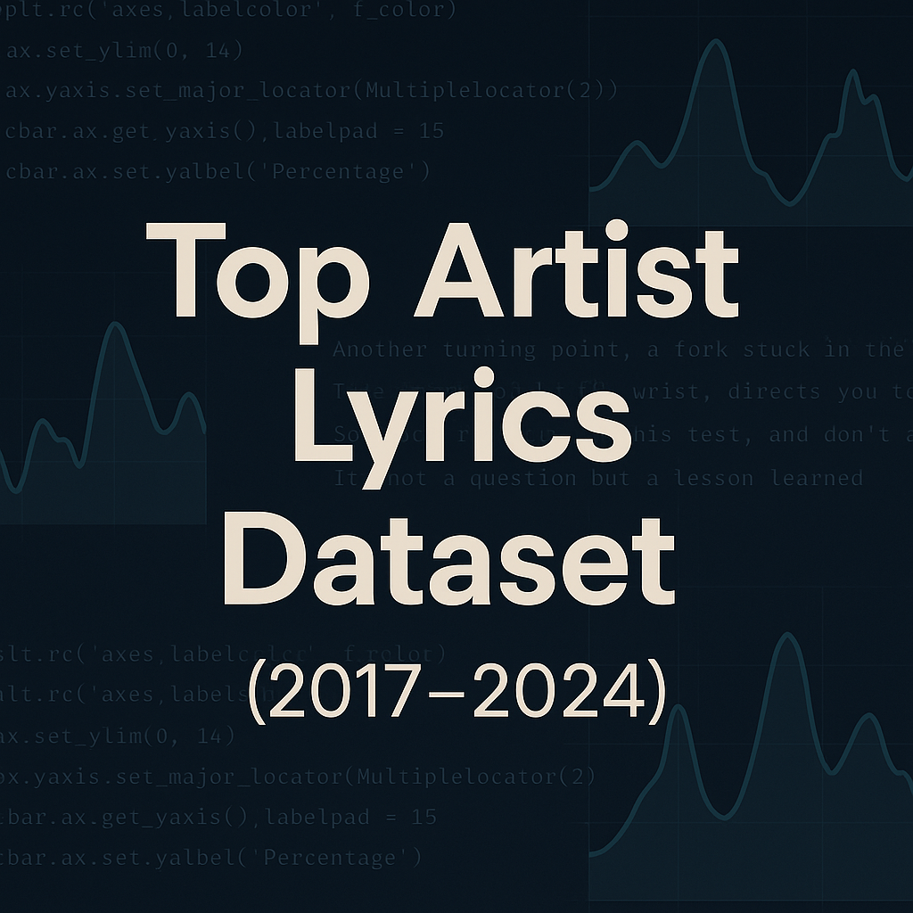

# 🎵 Song Lyrics Scraper & NLP Dataset (2017–2024)

This project scrapes and compiles a dataset of **song lyrics by top-charting artists** between **2017 and 2024**. It includes **artist names**, **song titles**, and **cleaned lyrics**—perfect for **Natural Language Processing (NLP)** and **music-related machine learning** tasks.

---

## 🧠 Use Cases

- 🎧 Sentiment analysis  
- 🎶 Topic modeling  
- 🔍 Text classification  
- 🧠 Lyric generation / LLM fine-tuning  
- ❤️ Emotion detection in music  
- 📀 Song recommendation systems

---

## 🗂️ Dataset Overview

| Column Name | Description               |
|-------------|---------------------------|
| `artist`    | Artist or band name       |
| `songs`     | Title of the song         |
| `lyrics`    | Full song lyrics (cleaned) |

---

## 📦 Files Included

- `azlyrics_artists_links.csv` — Raw artist list with song page links  
- `filtered_artist_links.csv` — Top artist list with valid URLs  
- `song_links_&_name.csv` — Song titles and respective song URLs  
- `final_lyrics_dataset.csv` — Final dataset with lyrics cleaned and ready

---

## 📊 Kaggle Dataset

You can also explore and download the collected dataset directly from Kaggle:

🔗 **Kaggle Dataset**: [Song Lyrics NLP Dataset (2017–2024)](https://www.kaggle.com/datasets/uvaissaifi/top-artist-songs-with-lyrics-20172024/data)

---

## 🛠️ Tools & Libraries Used

- `requests`, `BeautifulSoup` — Web scraping  
- `pandas` — Data wrangling  
- `lyricsgenius` — Backup lyrics via Genius API  
- `re`, `time` — Utility modules  
- `Streamlit` — Optional for UI or display

---

## 🔐 Disclaimer

This dataset is published for **educational and research purposes only**.

> All song lyrics remain the property of their respective copyright holders.  
> No commercial use or redistribution of copyrighted content.

---

## 🚀 Getting Started

1. Clone the repository  
2. Run the scraping script/notebook step by step  
3. Optionally configure Genius API key  
4. Save/export the dataset as `.csv` or push to Kaggle

---

## 📝 Notes

- Songs were filtered to include only **2017–2024** to focus on modern lyrics  
- **Older songs** were intentionally excluded  
- Data was scraped from publicly accessible pages with care

---

## ✍️ Author

**Uvais Saifi**  
_Data Scientist | NLP Developer | Python Enthusiast_

📧 Email: zaidsaifi523@gmail.com  
📘 Medium: [@zaidsaifi523](https://medium.com/@zaidsaifi523)

---

> If you use this dataset or project, consider giving credit or citing in your work.

